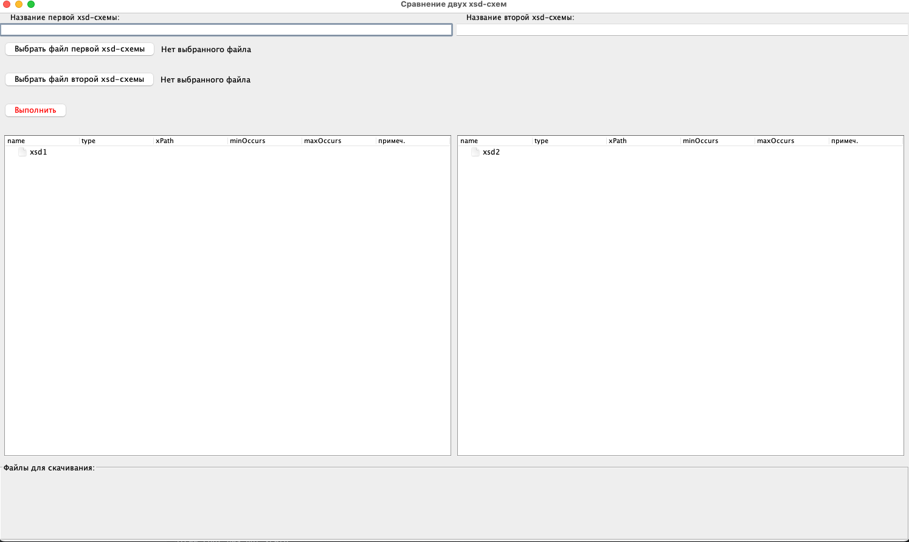
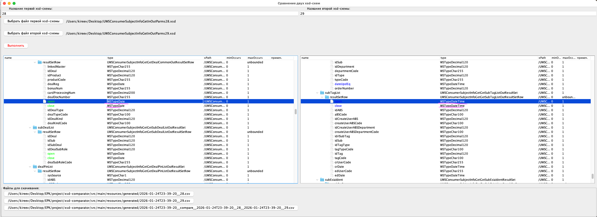
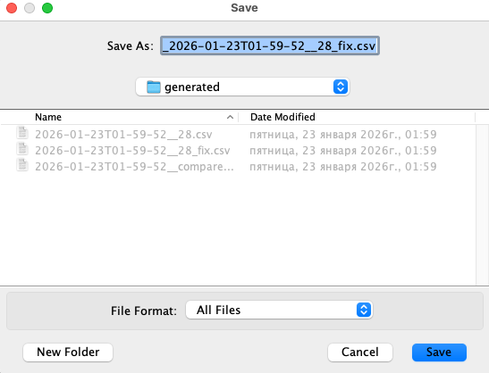
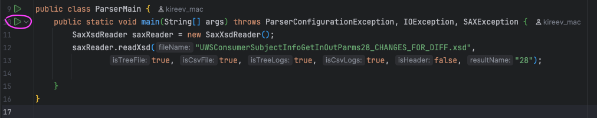

## Инструкция

### XSD-файлы
В схеме обязательно должны присутствовать корневые элементы `<element>`, и строго после начинаются complexType
```xml
<?xml version="1.0" encoding="UTF-8"?><xsd:schema xmlns:xsd="http://www.w3.org/2001/XMLSchema" 
          targetNamespace="http://UWSConsumerSubjectInfoGetInOutParms29.MDM.uws.alfabank.ru" 
          xmlns:tns="http://UWSConsumerSubjectInfoGetInOutParms29.MDM.uws.alfabank.ru" 
          xmlns:wsct="http://WSCommonTypes10.CS.ws.alfabank.ru">
	<xsd:import namespace="http://WSCommonTypes10.CS.ws.alfabank.ru" schemaLocation="WSCommonTypes10.xsd"/>

	<!-- Element Definitions -->
	<xsd:element name="UWSConsumerSubjectInfoGetGetInParms" type="UWSConsumerSubjectInfoGetGetInParms"/>
	<xsd:element name="UWSConsumerSubjectInfoGetGetOutParms" type="UWSConsumerSubjectInfoGetGetOutParms"/>

    <xsd:complexType name="UWSConsumerSubjectInfoGetGetInParms">
       <!-- ... -->
    </xsd:complexType>

   <xsd:complexType name="UWSConsumerSubjectInfoGetGetOutParms">
      <!-- ... -->
   </xsd:complexType>
</xsd:schema>

```

### Запуск через UI
Запустить [UiMain.java](src/main/java/ru/alfabank/epk/reactive/ui/UiMain.java) - откроется такой UI :-) <br>

<br><br>В результате выполнения получим файлы, которые можно сохранить на диск, и дерево сравнения схем с подсветкой отличий:<br>
 <br>


### Запуск алгоритмов
1) xsd-схемы - положить в папку [resources](src/main/resources)
2) сгенерированные файлы будут в папке [generated](src/main/resources/generated). `Сгенерированные файлы можно удалять, нельзя удалять саму папку!`
3) режим парсинга одной схемы - [ParserMain.java](src/main/java/ru/alfabank/epk/reactive/ok/ParserMain.java)
   <br>Вписать название схемы и выходного файла<br>
```java
      saxReader.readXsd("название схемы.xsd",
                true, true, true, true, false, "название выходного файла без расширения");
```
4) запустить зеленой стрелкой, дождаться появления файлов в папке [generated](src/main/resources/generated) <br>

5) режим сверки двух схем - [ComparatorMain.java](src/main/java/ru/alfabank/epk/reactive/ok/ComparatorMain.java)
   <br>Вписать название схем и выходных файлов<br>
```java
        Path path1 = saxReader.readXsd("название схемы №1.xsd",
            false, true, false, false, false, "название выходного файла №1 (без расширения)");

        //...

        Path path2 = saxReader.readXsd("название схемы №2.xsd",
                false, true, false, false, false, "название выходного файла №2 (без расширения)");
```
6) запустить аналогично п.4 из ComparatorMain